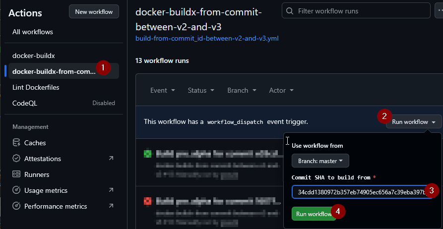

# PiGallery2 Docker Contribution guide (draft)

Remember to update all the Dockerfiles.

## Linting
To quality check your dockerfile changes you can use hadolint:

1. Start the docker daemon if it's not already started: `sudo dockerd`
2. Change dir to the docker folder.
3. Run hadolint on the alpine dockerfile: `docker run --rm -i -v ./.config/hadolint.yml:/.config/hadolint.yaml hadolint/hadolint < ./alpine/Dockerfile.build`
4. Run hadolint on the debian-trixie dockerfile: `docker run --rm -i -v ./.config/hadolint.yml:/.config/hadolint.yaml hadolint/hadolint < ./debian-trixie/Dockerfile.build`
7. Run hadolint on the debian-trixie selfcontained dockerfile: `docker run --rm -i -v ./.config/hadolint.yml:/.config/hadolint.yaml hadolint/hadolint < ./debian-trixie/selfcontained/Dockerfile`
8. Fix errors and warnings or add them to ignore list of the [hadolint configuration file](./.config/hadolint.yml) if there is a good reason for that. Read more [here](https://github.com/hadolint/hadolint).

### Building the docker image locally

Instructions below are incomplete, but might get you started.
```
$ git clone https://github.com/bpatrik/pigallery2.git
$ cd pigallery2/
$ npm install
$ npm run create-release
$ mkdir pigallery2-release
$ cp pigallery2.zip pigallery2-release/
$ cd pigallery2-release/
$ unzip pigallery2.zip
$ rm pigallery2.zip
$ docker buildx build \
  --platform linux/amd64 \
  -t pigallery2_test \
  -f ./docker/alpine/Dockerfile.build \
  . \
  --output=type=docker,dest=pigallery2-test
```

### Building a docker image using github actions

Need to build for another architecture than what you're working on? E.g. you want to install on an older RPi (arm/v7), but don't want to use it for building.

No problem: With a github actions workflow, you can both build it and make the ready image available on your private docker hub account. After you're done, you can delete the images again.

#### Preconditions

1. You need a docker-hub account!
   - https://app.docker.com/signup
2. You need a github account!
   - https://github.com/signup
3. You need to fork pigallery2
   - https://github.com/bpatrik/pigallery2/fork
4. You need to go to Settings -> Secrets and variables -> Actions for your fork and set these three values (with info from your docker-hub account)
   - `REGISTRY_NAMESPACE` (your docker-hub namespace - typically your username)
   - `REGISTRY_USERNAME` (your docker-hub username)
   - `REGISTRY_PASSWORD` (your generated Personal Access Token from docker-hub - needs to have read and write privileges)

#### Usage


Build and publish an image using the `build-from-commit_id-between-v2-and-v3` github actions workflow.

When you run the workflow / github action, it will ask you for a commit ID which will then be built and published to docker hub, given the 3 values above.


